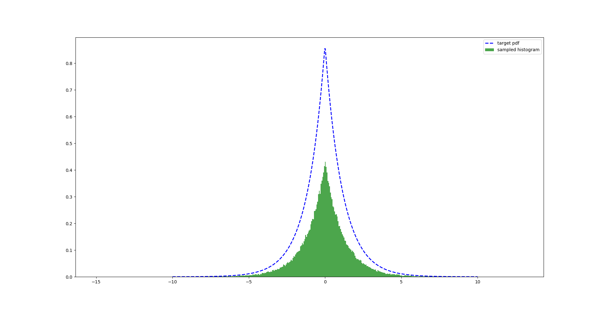

# PGM
[](https://travis-ci.org/koriavinash1/pgm)
[](https://pgm.readthedocs.io/en/latest/?badge=latest)
[](https://badge.fury.io/py/ppgm)
[](https://opensource.org/licenses/MIT)

Probabilistic graphs: Representation, Learning, and Inference

## Features

- [x] Representation
  - [x] Bayesian Network Representation
  - [x] Linked List BN Representation
  - [x] Linked List MN Representation
  - [ ] Conditional Estimation
  - [ ] Marginal Estimation
  - [ ] Joint Estimation
- [x] Inference
  - [x] Metropolis-Hastings algorithm
  - [x] Gibbs Sampling on 2d grid
  - [ ] Generalized Gibbs Sampling
  - [ ] Message Parsing and BP
  - [ ] Loopy BP
  - [ ] VE
  - [ ] Causal Interventions
- [x] search methods
  - [x] DFS
  - [x] BFS
- [x] Additional
  - [x] Finding Active Trails
  - [ ] Max clique size and clique node
  - [ ] Calculate tree-width
- [ ] Learning 
- [x] Miscellaneous
  - [x] Random BN and MN generation
 
## Installation
```
pip install ppgm
```
  
## Usage
Check examples to understand all routines

### LinkedList BN representation
```
from pgm.helpers.common import Node
from pgm.representation.LinkedListBN import Graph

rootNode = Node('rootNode')

graph = Graph(rootNode)
graph.add_node('node1', 'rootNode')
graph.add_node('node2', 'rootNode')
graph.add_node('node3', 'node1')
graph.add_edge('node2', 'node3')
graph.print(rootNode)

# =============== OUTPUT ===============
node: rootNode, children: ['node1', 'node2'], parents: []
node: node1, children: ['node3'], parents: ['rootNode']
node: node2, children: ['node3'], parents: ['rootNode']
node: node3, children: [], parents: ['node1', 'node2']
```

### Search dfs
```
from pgm.helpers.search import dfs

root = rootNode
searchNode = 'node4'
node = dfs(root, searchNode).searchNode
```

### GetTrails for above BN
```
from pgm.helpers.common import Node
from pgm.representation.LinkedListBN import Graph

rootNode = Node('rootNode')

graph = Graph(rootNode)
graph.add_node('node1', 'rootNode')
graph.add_node('node2', 'rootNode')
graph.add_node('node3', 'node1')
graph.add_edge('node2', 'node3')

from pgm.helpers.trails import findTrails

ftrails = findTrails(rootNode, 'rootNode', 'node3')
ftrails.print()

# =============== OUTPUT ===============
[['rootNode', 'node1', 'node3'], ['rootNode', 'node2', 'node3']]
```

### MH
```
from pgm.inference.MetropolisHastings import MH
from matplotlib import pyplot as plt

def Gamma(theta, k = 1):
    def G(k):
        if k <= 0: return 1
        elif k == 0.5: return np.pi **0.5
        return k*G(k-1)
    def distribution(x):
        x = np.abs(x)
        return (x**(k-1))*np.exp(-x/theta)/((theta**k) * G(k))    
    return distribution


def proposalDistribution(sigma=0.1):
    """
        Describes example proposal distribution
        considers gaussion distribution with fixed sigma
        as the mean keeps changing it's made an inner function argument
    """
    def QDistribution(param = 0):
        return lambda x: (1/(((2*np.pi)**0.5) * sigma))*np.exp(-((x-param)**2)/ (sigma**2))

    return QDistribution, lambda x: np.random.normal(x, sigma)
    
x = np.linspace(-20, 20, 500)
fx = function(x)

proposalDist, proposalSamp = proposalDistribution(sigma = 2.0)
mh = MH(function, 100, proposalDist, proposalSamp)
for _ in range(1000):
    next(mh.sampler())

sampledvalues = np.array(mh.x_seq)
plt.plot(x, fx, 'b--', linewidth=2.0)
plt.hist(sampledvalues, 50, density=True, stacked=True, facecolor='g', alpha=0.7, linewidth=0)
plt.legend(['target pdf', 'sampled histogram'])
plt.show()
```

## Contact
- Avinash Kori (koriavinash1@gmail.com)
